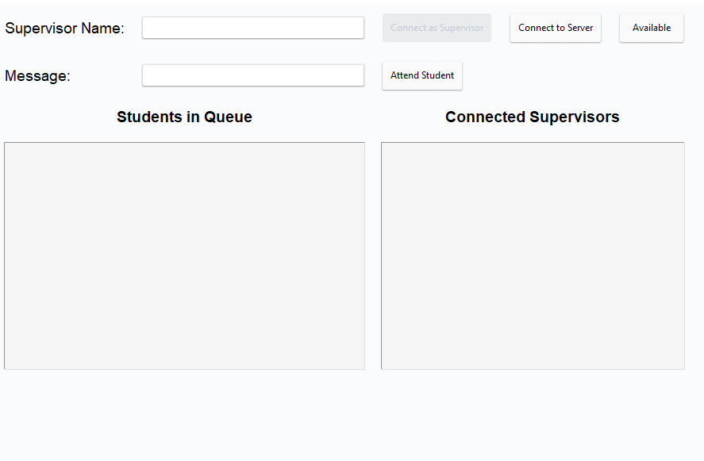
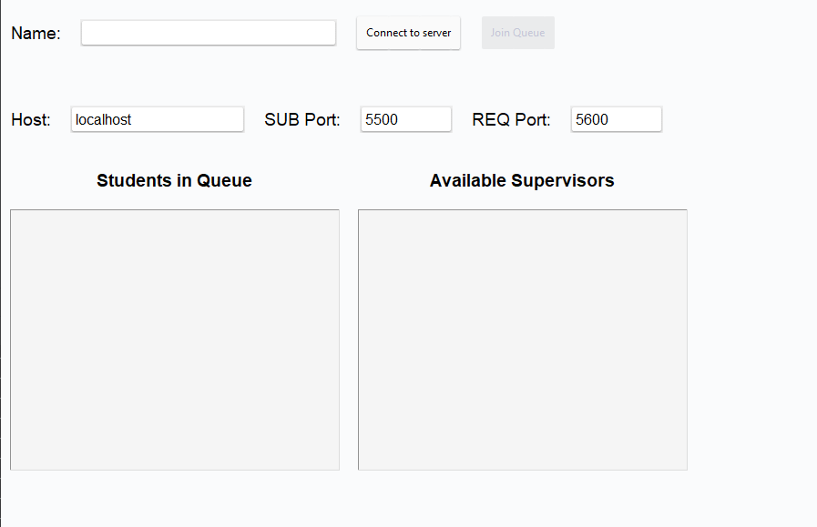

# Distributed queue system - API documentation


## Authors
 * **Nibar Ahmed** (a21nibar)
 * **Raman Mohammed** (a21rammo)

## Introduction
This project implements a distributed queue system with a client-server architecture. The server is built using Java and Spring Boot, while the client is developed in Python with a Tkinter-based GUI.

## Reflection
During the development, we maintained a structured workflow with protected main branches, requiring pull requests and code reviews. Manual tests were conducted on each branch before merging PRs. The project was both enjoyable and educational.

## Getting started

You need to have the following installed in order to run this project:

- Java 17 or later
- Python 3.12 or later
- A Maven environment
  
### Setting Up the server
1. Open a terminal and navigate to the `server` directory, located at the root of the project.
2. Run the following command to install all the dependencies:
```console
mvn install
```
After the dependencies have been installed successfully, use the following command to run the server:
```console
mvn spring-boot:run
```
### Setting Up the client

1. The client directory is located at the root of the project. Open a terminal and navigate to python-client.
2. Run the following command to install the required libraries:
   
```console
pip install -r requirements.txt
```

3. The student and supervisor client is located under python-client/src and can be run using the following command:
   
```console
python student.py
python supervisor_client.py
```

## API Documentation

### Requests and responses

#### Connection request
Sent to the server to verify that a connection has been established
```json
{
    "type": "startup",
    "client_number": "<a unique number for the client>"
}
```
server response:
```

"Acknowledged startup"

```
#### Enter the queue
Indicates that a user with specified name wants to enter the queue.
A single user may connect through several clients. If another client with the same name is already connected, both clients hold the same place in the queue.
```json
{
    "enterQueue": true,
    "name": "<name>",
    "clientId": "<unique id string>"
}
```

server response:

```json
{
    "ticket": <index represents the users' place in the queue>
     "name":"<name>"
}
```

#### Heartbeats
Sent to the server in order to maintain the students' place in the queue. If the client is inactive for more than 4 seconds it's removed from the queue.

```json
{
    "type": "heartbeat"
    "name":"<student name>"
    "clientID":"<unique id string>"
}
```

server response:
```
An empty JSON string
```

#### Connect as supervisor
Sent to the server in order to connect as a supervisor instead of a student
```json
{
    "type": "supervisor"
     "supervisorName": "<name of the supervisor>"
     "addSupervisor": true
}
```

server response:
```json
{
    "status":"<success>"
    "message": "<a message indicating that the supervisor was added>"
}
```

#### Attend the queue
Sent to the server when a supervisor attends a student in the queue
```json
{
    "message":"<the message that is going to be sent to the student when they are informed about their turn to be attended.>"
     "type":"supervisor", "attendStudent":true
    "supervisorName": "<name of the supervisor that is going to attend the student>"
}
```
server response:
```json
{
    "status": "success"
     "mesage":"<a message which indicates that a student is being attended>"
}
```
#### Change the supervisor status to available
Sent to the server in order to make the supervisor available
```json
{
"type": "supervisor"
     "makeAvailable": true
     "supervisorName":"<name of the supervisor that is going to be made available>"
}
```
server response:
```json
{
    "status": "<success>",
    "message":"<message which indicates that the supervisors' status has been changed>"
}
```
#### Errors
The server sends the following when an error is encountered:
```json
{
    "message": "<a description of the error>"
     "error":"<error type, invalidMessage>"
}
```
### Broadcasts
#### Queue status
Sent to all clients in response to any changes in the queue, for example new clients entering the queue or students receiving supervision. The queue status is an ordered array of Queue tickets, where the first element represent the first student in the queue.
```json

{
    "ticket": <index>
     "name": "<name>"
}, 

```
#### Supervisor status
Sent to all clients in response to any changes in the list of supervisors, for example new supervisors connecting or when the status of a supervisor changes.

```json
{
    "name": <name>
     "status": "pending"|"available"|"occupied",
    "client": undefined|{"ticket":<index>"
    "studentName":"<name>"
}}
```

#### Student messages
the server sends messages specified by the supervisor to the student that is being attended.
```json
{
    "supervisor":"<name of supervisor>",
    "message":"<message from supervisor>"
}
```

## Server Architecture

This project adopts an event-driven architecture, using the Pub/Sub pattern through ZeroMQ sockets. This style is beneficial for creating scalable distributed system, allowing for efficient communication.

### Retry-Pattern for Connection

The connection utilizes a retry mechanism, attempting to establish a connection multiple times before giving up and sending an error message to the user.

### Event-Driven with Pub/Sub Socket
The system is event-driven, with events generated by different components of the system, such as when a new student joins or a student is deleted. Subscribers listen to these events and respond accordingly. The Pub/Sub socket in ZeroMQ is used to broadcast messages to all connected clients.

### Components

- **Event Object**: Represents an occurrence or a change in state in the system.
- **Event Listener**: Listenes to the event and defines the actions to be taken when an event occurs.
- **Service Folder**: Contains the business logic of the application.

### Config Files and Workers
Config files manage the ZeroMQ context and sockets, handling socket binding and error management. Workers such as `ResponderWorker` and `PublisherWorker` handles various requests and broadcast relevant information.

### Services and Business Logic

Services such as `StudentService` and `SupervisorService` manage the  business logic, including managing students and supervisors, assignments, and queue management. The system tries to keep only business logic related in these files. We tried to keep everything related to publish and responding out of the service folder, in order to keep a good code structure.

### Annotation in Spring framework
Spring Framework utilizes annotations like @Bean for methods that produce beans managed by the Spring container, typically this is singleton pattern. This ensures a single instance is created and managed, optimizing resources and simplifying development.

Dependencies
The project uses Maven to manage dependencies, including Spring Boot, JSON.org, Lombok, Java Validation API, Javax Annotation API, Spring Integration ZeroMQ, JeroMQ, and Spring Boot Maven Plugin.

## Client (Python)

The client side of the project is developed using Python, using the `tkinter` library for creating the Graphical User Interface (GUI). `tkinter` is known for its simplicity and is user-friendly for beginners in GUI development.

The project is organized into four distinct folders, each serving a specific purpose:

- `app`: Contains the user interface, also seperated versions for students and supervisors.
- `config`: Holds configuration files such as connection to server
- `utils`:  the logic for the application, also seperated into student and supervisor versions.
- `error`: Manages exception handling





## Indepth explanation of classes and methods in the Server

### ResponderWorker

#### Description
`ResponderWorker` handles incoming client requests and sends responses back.

#### Methods

- `handleAllRequest()`: Continuously handles incoming client requests and returns them to methods based on the type of message.
- `handleErrorMessage(String errorType, String message)`: A JSON error message and sends it through the socket.
- `handleHeartbeat(JSONObject jsonRequest)`: Handles heartbeat messages from clients, updates client heartbeat
- `handleStartupMessage(JSONObject jsonRequest)`: Handles startup messages from clients. Broadcasts the updated queue and supervisor status and sends acknowledgment.
- `handleSupervisorRequest(JSONObject jsonRequest)`: Handles incoming supervisor requests and calls  methods to process them.
- `handleStudentRequest(JSONObject json)`: Processes student requests and assigns a ticket. This also sends response back based on the event

### PublisherWorker

#### Description
`PublisherWorker` is responsible for broadcasting updated queue and supervisor status. It also handles student message for specific students.

#### Methods

- `broadcastQueue(List<Student> queue)`: Broadcasts the current queue of students.
- `convertQueueToJson(List<Student> queue)`: Converts the student queue to a JSON.
- `sendStudentMessage(String supervisorName, String studentName, String message)`: Sends a student message.
- `broadcastSupervisorsStatus()`: Broadcasts the status of all connected supervisors.

### StudentService

### Description
`StudentService` manages the student queue and performs operations such as adding, removing, and updating students in the queue. 

#### Methods

- `getTicket()`: Retrieves the ticket of a student based on their position in the queue.
- `manageStudent(String name, String clientId)`: Manages the addition of students to the queue and their client IDs.
- `addStudent(Student student)`: Adds a new student to the queue.
- `removeStudentByName(String name)`: Removes a student by name from the queue
- `updateClientHeartbeat(String clientId)`: Updates the last received heartbeat for a client.
- `removeInactiveStudents()`: Scheduled (with scheduler annotation from spring boot) method to remove students who have not sent a heartbeat within a given time frame.
- `removeFirstStudent()`: Removes and returns the first student in the queue.
- `getQueue()`: Returns a copy of the current student queue.

### SupervisorService

#### Description
`SupervisorService` manages the supervisors, handling their status and attended to which student. It is responsible for adding new supervisors, displaying connected supervisors, and managing the attendance of students by supervisors.

#### Methods

- `addSupervisor(String supervisorName)`: Adds a new supervisor to the list.
- `displayAllConnectedSupervisors()`: Returns a list of all connected supervisors.
- `assignStudentToSupervisor(String supervisorName, String message)`: Assigns the first student in the queue to a superviso.
- `findSupervisorByName(String supervisorName)`: Finds and returns a supervisor by name from the list.
- `isSupervisorAvailable(Supervisor supervisor)`: Checks if the given supervisor is available.
- `findFirstStudentInQueue()`: Finds and returns the first student in the queue.
- `attendToStudent(Supervisor supervisor, Student student, String message)`: Marks a supervisor as occupied and removes the student from the queue.
- `makeSupervisorAvailable(String supervisorName)`: Marks a supervisor as available from occupied.

### Event Listeners

#### SupervisorEventListener
- Listens to Supervisor related events and broadcasts status and queue.

#### StudentEventListener
- Listens to Student related events and broadcasts queue.

### Events

#### Supervisor Events
- NewSupervisorEvent: Triggered when a new Supervisor is added.
- SupervisorAssignedStudentEvent: Triggered when a Supervisor is assigned a Student.
- SupervisorStatusChangedEvent: Triggered when a Supervisor’s status is changed.

#### Student Events
- NewStudentEvent: Triggered when a new Student joins.
- StudentDeletedEvent: Triggered when a Student is removed.

### Configurations

#### ZeroMqConfig
- Configuration for ZeroMQ Sockets.
- Provides beans for zmqPublisherSocket and zmqResponseSocket.


#### AsyncConfig
- Configuration to enable asynchronous execution. The method will only require @async annotation to be async.


